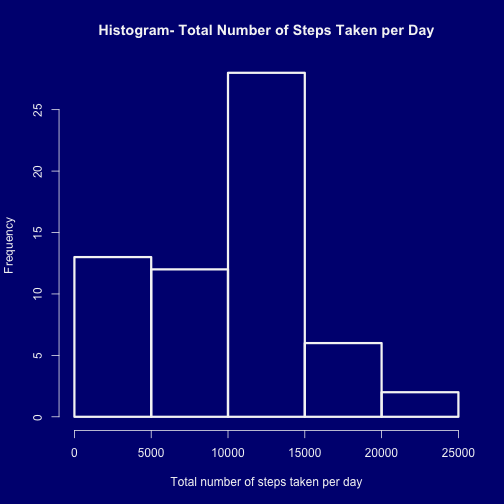
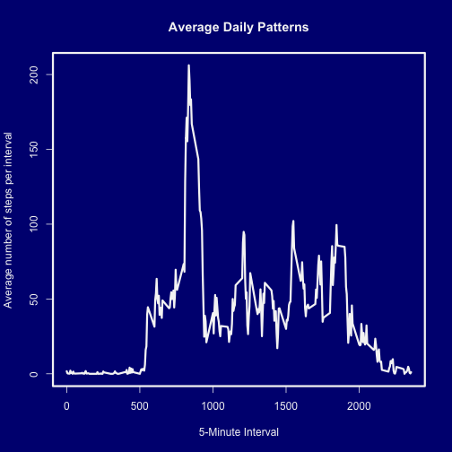
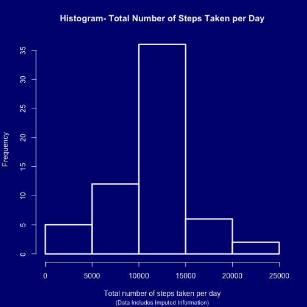
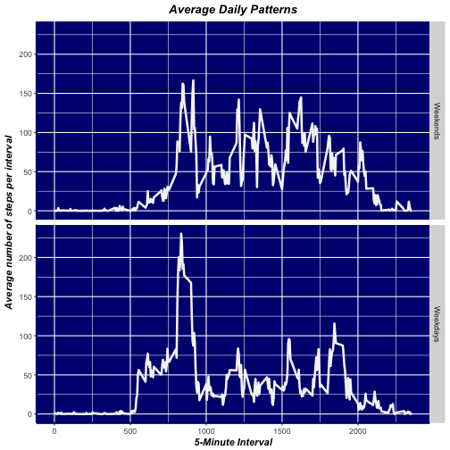

Reproducible Research- Week 2 Assignment
===========================================
### Submitted by Yash Deshpande

## *Reading in the activity data*


```r
library(plyr)
library(timeDate)
library(ggplot2)
ActivityData <- read.csv("activity.csv")
```

## *Calculating the number of steps taken per day*

```r
c1 <- colors()
ActivityPerDay <- aggregate(ActivityData$steps, by=list(ActivityData$date), FUN=sum, na.rm=TRUE)
names(ActivityPerDay) <- c("Date", "Total_Steps")
par(bg=c1[490], col.axis= c1[651], col.main=c1[651], col.lab=c1[651], fg=c1[651], lwd=3)
hist(ActivityPerDay$Total_Steps, xlab="Total number of steps taken per day", ylab="Frequency", main="Histogram- Total Number of Steps Taken per Day")
```



### Calculating the mean and median of steps taken per day

```r
MeanStepsPerDay <- mean(ActivityPerDay$Total_Steps)
MedianStepsPerDay <- median(ActivityPerDay$Total_Steps)
sprintf("The mean of the total number of steps taken per day is: %s", MeanStepsPerDay)
```

```
## [1] "The mean of the total number of steps taken per day is: 9354.22950819672"
```

```r
sprintf("The median of the total number of steps taken per day is: %s", MedianStepsPerDay)
```

```
## [1] "The median of the total number of steps taken per day is: 10395"
```

## *Average daily patterns*

```r
ActivityPerInterval <- aggregate(ActivityData$steps, by=list(ActivityData$interval), FUN=mean, na.rm=TRUE)
names(ActivityPerInterval) <- c("Interval", "Avg_steps")
par(bg=c1[490], col.axis= c1[651], col.main=c1[651], col.lab=c1[651], fg=c1[651], lwd=3)
plot(ActivityPerInterval$Interval, ActivityPerInterval$Avg_steps, type='l', xlab="5-Minute Interval", ylab="Average number of steps per interval", main="Average Daily Patterns")
```



### Which 5-minute interval has the maximum number of steps (across all days)?

```r
ActivityPerIntervalMax <- ActivityPerInterval[which(ActivityPerInterval$Avg_steps==max(ActivityPerInterval$Avg_steps)),]
sprintf("Interval number %s has the maximum number of steps across all days.", ActivityPerIntervalMax$Interval)
```

```
## [1] "Interval number 835 has the maximum number of steps across all days."
```

## *Imputing missing data*

### Missing data has been imputed using the mean of number of steps per interval

```r
ActivityNA <- ActivityData[which(is.na(ActivityData$steps)),]
ActivityIntervalMean <- aggregate(ActivityData$steps, by=list(ActivityData$interval), FUN=mean, na.rm=TRUE)
names(ActivityIntervalMean) <- c("interval", "Avg_steps")
intmz_na <- join(ActivityNA, ActivityIntervalMean, by="interval")
intmz_na$steps <- intmz_na$Avg_steps
intmz_na$Avg_steps <- NULL
ActivityDataNullImputed <- intmz_na
ActivityDataNonNull <- ActivityData[which(!is.na(ActivityData$steps)),]
FinalImputedActivityData <- rbind(ActivityDataNonNull, ActivityDataNullImputed)
```

## *Re-calculating the number of steps taken per day (full dataset)*

```r
c1 <- colors()
FinalActivityPerDay <- aggregate(FinalImputedActivityData$steps, by=list(FinalImputedActivityData$date), FUN=sum, na.rm=TRUE)
names(FinalActivityPerDay) <- c("Date", "Total_Steps")
par(bg=c1[490], col.axis= c1[651], col.main=c1[651], col.lab=c1[651], col.sub=c1[651], fg=c1[651], lwd=3, cex.sub=0.8)
hist(FinalActivityPerDay$Total_Steps, xlab="Total number of steps taken per day", ylab="Frequency", main="Histogram- Total Number of Steps Taken per Day", sub="(Data Includes Imputed Information)")
```



### Re-calculating the mean and median of steps taken per day

```r
FinalMeanStepsPerDay <- mean(FinalActivityPerDay$Total_Steps)
FinalMedianStepsPerDay <- median(FinalActivityPerDay$Total_Steps)
sprintf("The mean after data imputation of the total number of steps taken per day is: %s", FinalMeanStepsPerDay)
```

```
## [1] "The mean after data imputation of the total number of steps taken per day is: 10766.1886792453"
```

```r
sprintf("The median after data imputation of the total number of steps taken per day is: %s", FinalMedianStepsPerDay)
```

```
## [1] "The median after data imputation of the total number of steps taken per day is: 10766.1886792453"
```

## *What is the impact of imputing missing data on the estimates of the total daily number of steps?*

### As seen from the updated histogram, the distribution of the activity data becomes more evely spread. The mean as well as the medianof the total number of steps taken per day have increased, and are seen to be equal in the full dataset (which contains the imputed data).

## *Activity distribution over weekdays and weekends*

### A flag is added to the final dataset (containing imputed data) using the 'isWeekday()' function from the timeDate package


```r
FinalImputedActivityData$Weekday <- isWeekday(FinalImputedActivityData$date)
FinalActivityPerInterval <- aggregate(FinalImputedActivityData$steps, by=list(FinalImputedActivityData$interval, FinalImputedActivityData$Weekday), FUN=mean)
names(FinalActivityPerInterval) <- c("Interval", "Weekday", "Avg_steps")

weekday_id <- c(`TRUE` = "Weekdays",`FALSE` = "Weekends")
black.bold.italic.text <- element_text(face = "bold.italic", color = "black")

g <- ggplot(data=FinalActivityPerInterval, aes(Interval, Avg_steps)) + geom_line(size=1.2, col=c1[651]) + facet_grid(Weekday~., labeller=as_labeller(weekday_id))

h <- g + labs(title="Average Daily Patterns", x="5-Minute Interval", y="Average number of steps per interval")

i <- h + theme(axis.line = element_line(colour = "darkblue", 
                                         size = 1, linetype = "solid"), panel.background = element_rect(c1[490]),  axis.title=black.bold.italic.text, title=black.bold.italic.text, plot.title = element_text(hjust = 0.5))
print(i)
```



